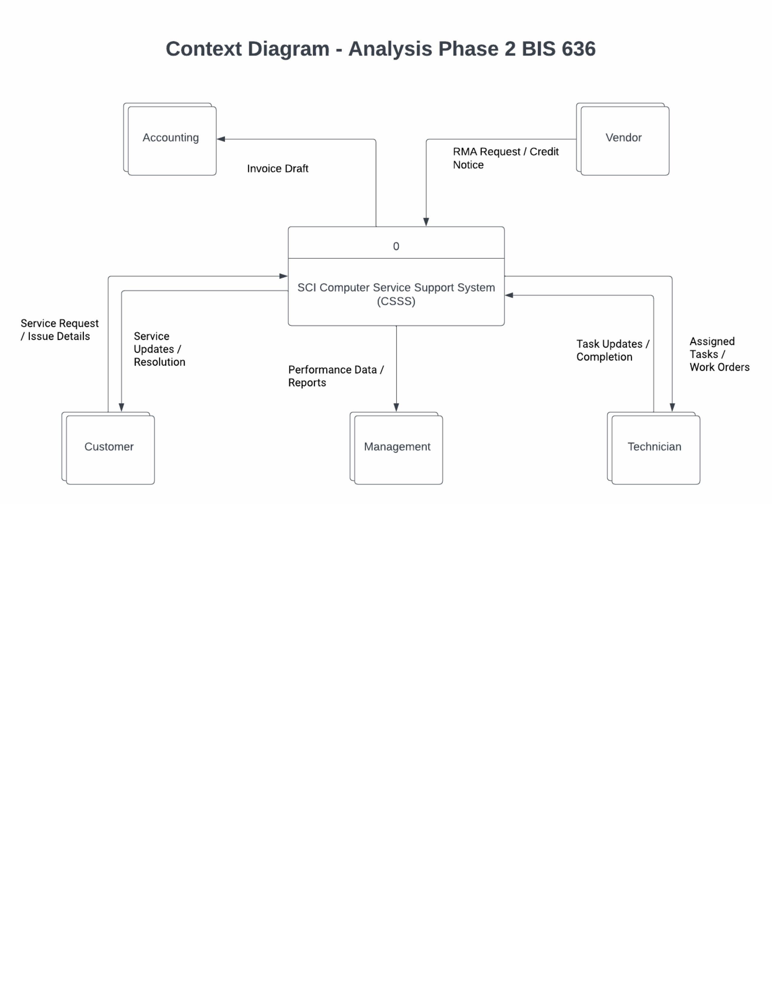

# SCI Computer Service Support System (CSSS)

Enterprise-level service operations system designed using structured Systems Analysis & Design methodology to unify Service Requests, Technician Scheduling, Inventory Management, RMA Tracking, and Billing.

---

## Business Problem

SCI relied on informal task tracking ("pings"), manual FIFO inventory counting, and disconnected RMA and billing workflows. This resulted in:

- Missed or delayed service requests  
- Limited technician workload visibility  
- Inventory overstocking and stockouts  
- Manual reconciliation between field work and billing  
- No structured SLA monitoring  
- Minimal operational reporting  

---

## System Architecture Overview

The system was logically modeled before implementation using structured analysis techniques.

### Context Diagram

The context diagram defines the system boundary and shows interactions with:

- Customers  
- Technicians  
- Vendors  
- Accounting  
- Management  

---

### Level-0 Data Flow Diagram (DFD)

Core processes defined:

1. Intake & Schedule Service Request  
2. Perform Service  
3. Invoice & Notify  
4. Manage Inventory & RMAs  .

Logical data stores modeled:

- D1 – Service Requests  
- D2 – Schedules & Time  
- D3 – Inventory  
- D4 – Billing / Invoices  
- D5 – RMA Records  

---

### Entity Relationship Diagram (ERD)

Key entities modeled:

- Customer  
- ServiceRequest  
- WorkOrder  
- Technician  
- TechAssignment  
- TimeEntry  
- InventoryItem  
- Vendor  
- RMA  
- Invoice  
- InvoicePartLine  
- InvoiceLaborLine  
- PartUsage  

Relational design highlights:

- One-to-many Customer → ServiceRequest  
- One-to-many ServiceRequest → WorkOrder  
- Many-to-many Technician ↔ WorkOrder (via TechAssignment)  
- FIFO inventory costing structure  
- RMA traceability linked to Work Orders and Inventory  
- Separate invoice labor and part line modeling  
- Full normalization and cardinality definition  

---

## Functional Requirements Delivered

Designed 34 structured functional requirements including:

- Centralized Service Request lifecycle management  
- Technician assignment and work queue tracking  
- SLA response and completion time monitoring  
- Perpetual inventory with FIFO costing logic  
- Lot and serial number traceability  
- RMA lifecycle management with vendor linkage  
- Automated invoice draft generation from completed work  
- Role-based access control  
- Audit logging for system changes  
- Operational dashboards for workload and inventory health  

Full documentation is available in the `/docs` folder.

---

## Skills Demonstrated

- Systems Analysis & Design (SDLC methodology)  
- Business Process Modeling (Gane-Sarson DFD modeling)  
- Context and Level-0 decomposition  
- Relational Data Modeling and Cardinality Design  
- Requirements Engineering  
- Workflow Architecture  
- Inventory Costing Logic (FIFO)  
- SLA and KPI Framework Design  
- Enterprise Documentation Standards  

---

## Project Structure

sci-service-support-system-analysis/
│
├── docs/
│ ├── 01_Requirements_Definition.pdf
│ ├── 02_Context_Diagram.pdf
│ ├── 03_Level0_DFD.pdf
│ └── 04_ERD_Data_Model.pdf
│
├── diagrams/
│ ├── context_diagram.jpg
│ ├── level0_dfd.jpg
│ └── erd_data_model.jpg
│
└── README.md

---

## Business Impact (If Implemented)

- Reduced missed or forgotten service requests  
- Improved technician utilization visibility  
- Real-time inventory accuracy  
- Reduced stockouts and excess inventory risk  
- Automated billing handoff to accounting  
- Measurable SLA performance tracking  
- Improved vendor RMA recovery and tracking  

---

## Summary

This project demonstrates structured enterprise system design from business problem analysis through logical modeling and data architecture definition. It reflects production-level systems thinking applied to service operations, inventory management, and financial integration workflows.
